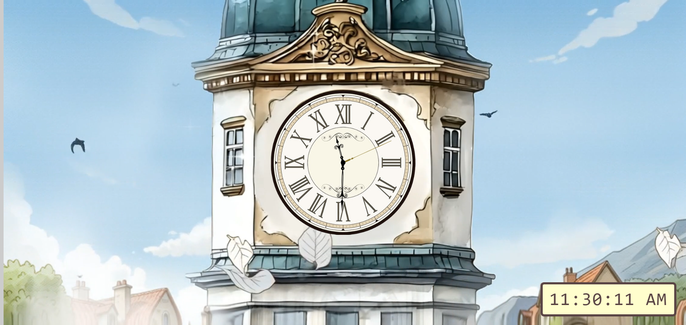

# 🕰️ The Clocktower

Welcome to the Clocktower project! 🏰 This is a clocktower built using **HTML**, **CSS**, and **JavaScript**. It features an analog clock with a ticking sound effect, an animated background, and a bell that rings every hour. For those who aren't used to reading an analog clock, there's a digital display in the bottom-right corner showing the current time.

---

## 📜 What's Inside?

- **Analog Clock**: A beautiful analog clock with ticking sound effects.
- **Background Animation**: A scenic animated background with elements like leaves and clouds moving.
- **Hourly Bell Sound**: A bell rings every hour, just like a real clocktower!
- **Digital Display**: A digital time display is located in the bottom-right corner for convenience.

---

## 🚀 **Demo**

You can view a live demo of the project here:  
[**Live Demo**](https://Jasu-html.github.io/CLOCKTOWER/index.html)

---

## 🛠️ How to Use

To run this project locally:
1. Clone the repository:
   ```bash
   git clone https://github.com/Jasu-html/CLOCKTOWER.git
2. Open the index.html file in your browser, and you'll see the clocktower in action!

---

## 🎶 Sound Effects

- **Ticking sound**: The clock ticks every second.
- **Bell sound**: The bell chimes every full hour.

You can customize the sound files if you'd like, just replace the corresponding `.mp3` or `.wav` files in the directory.

---

## 💻 Technologies Used

- **HTML**: The structure of the clocktower and the digital time display.
- **CSS**: The clock’s design, background, and overall styling.
- **JavaScript**: The functionality of the analog clock, the ticking sound, and the bell chimes.

---

## 👨‍💻 Credits

This project was built by **Justin Alarcio** as a fun activity exercise in javascript for CIS 211 - Application Development.

Special thanks to the creators of the open-source audio and image files I used for the ticking and bell sounds, and clocktower background and clock hands!

---

## 🧑‍⚖️ License

Feel free to clone or fork this project for personal use or to learn more about how it works. For any commercial use or distribution, please provide appropriate credit. 😅

---

## 📸 Preview
Here's a preview of the project:


